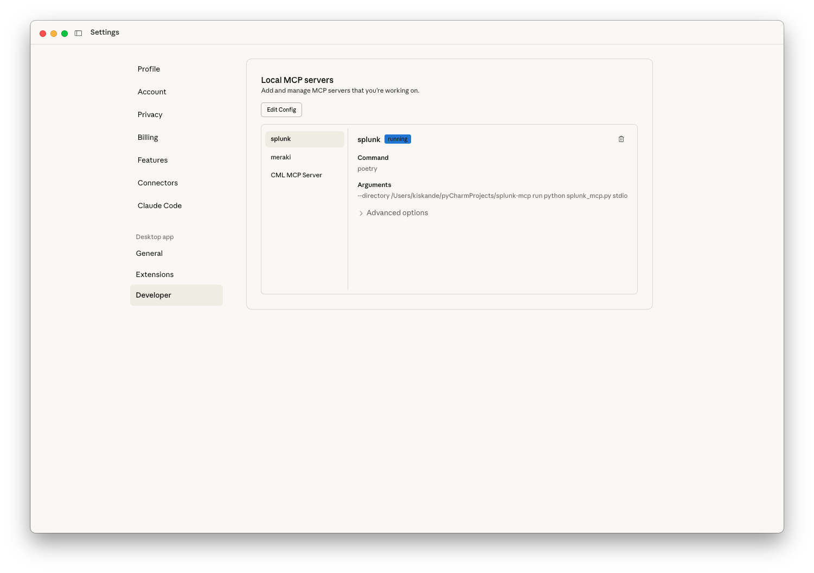
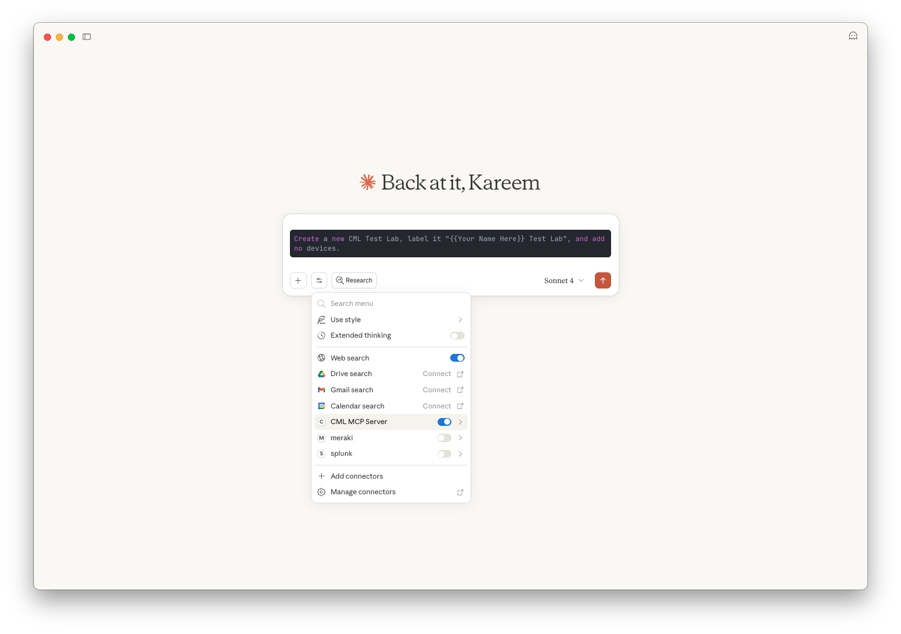
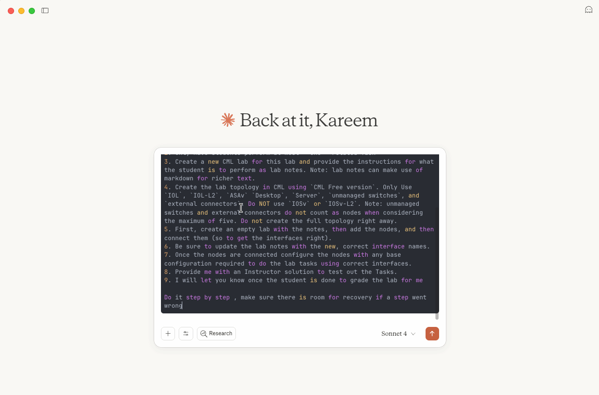

# Laborübung: Cisco Modeling Lab mit MCP


## Einführung

In dieser Laborübung sammeln Sie praktische Erfahrungen mit **Cisco Modeling Labs (CML)** und dem **Model Context Protocol (MCP)**. Sie erfahren, wie CML eine leistungsstarke Umgebung für die Erstellung und das Testen von Netzwerktopologien bietet und wie MCP eine KI-gestützte Ebene hinzufügt, die die Interaktion mit CML schneller und intuitiver macht. Durch die Arbeit mit diesen Tools sammeln Sie praktische Erfahrungen bei der Einrichtung, Konfiguration und Verwendung von MCP mit CML.

> **Neu ab CML 2.10:** Der MCP-Server ist direkt in CML integriert. Eine separate Installation eines MCP-Servers auf dem eigenen Rechner (bisher mit `uv` und `git clone`) entfällt. Auf dem Client wird nur noch **Node.js** benötigt, damit Claude Desktop über `mcp-remote` eine Verbindung zum MCP-Server in CML aufbauen kann.

## Lernziele

- Aktivieren Sie den **integrierten MCP-Server in CML 2.10**.
- Verwenden Sie Claude Desktop als **MCP-Client**, um mit dem Server zu interagieren.
- Erstellen Sie ein **KI-generiertes CML-Labor** mithilfe der MCP-Architektur und einem vorbereiteten und angereicherten Prompt.

## Voraussetzungen

- Zugriff auf einen **Cisco Modeling Labs (CML)-Server ab Version 2.10** *(URL/Anmeldedaten werden bereitgestellt)*
- **Claude Desktop** installiert (macOS oder Windows)
- **Node.js (LTS)** installiert (liefert den Befehl `npx`)
  - https://nodejs.org
- Ein Terminal/eine Shell (Terminal unter macOS, PowerShell unter Windows)

## Aufgaben

### Schritt 1: MCP-Server in CML aktivieren und Konfiguration abrufen

#### 1a) MCP-Server aktivieren

**Bei einer Neuinstallation der CML-VM** wird der MCP-Server direkt im Einrichtungsassistenten angeboten. Im Dialog *„Select which optional services should be enabled“* aktivieren Sie mit der **Leertaste** den Eintrag **MCPServer** (*MCP server for LLMs*) und bestätigen mit **Continue**.


> **Hinweis:** Wurde der Dienst bei der Installation nicht ausgewählt, kann er jederzeit nachträglich im **Cockpit** der CML-VM (`https://<CML-IP>:9090`) aktiviert werden – dort, wo auch die anderen optionalen Dienste (OpenSSH, PATty) verwaltet werden.

#### 1b) Konfiguration für den MCP-Client abrufen

1. Melden Sie sich an der CML-Weboberfläche an.
2. Öffnen Sie oben rechts **Tools** → **MCP Clients**.


3. CML zeigt eine fertige **JSON-Konfiguration** für den MCP-Client an. Die IP-Adresse Ihres CML-Servers ist darin bereits eingetragen. Kopieren Sie sie mit **COPY** oder speichern Sie sie mit **DOWNLOAD JSON**.


```json
{
  "mcpServers": {
    "Cisco Modeling Labs (CML)": {
      "command": "npx",
      "args": [
        "-y",
        "mcp-remote",
        "https://<CML-IP>/mcp",
        "--header",
        "X-Authorization:${CML_AUTH_HEADER}"
      ],
      "env": {
        "CML_AUTH_HEADER": "Basic <base64_encoded_cml_credentials>",
        "NODE_TLS_REJECT_UNAUTHORIZED": "0"
      }
    }
  }
}
```

> **Was passiert hier?**
> - `npx -y mcp-remote` startet lokal eine kleine Brücke (Proxy). Claude Desktop spricht mit dieser Brücke, die Brücke leitet die Anfragen per HTTPS an den MCP-Server in CML weiter.
> - `X-Authorization` überträgt Ihre CML-Anmeldedaten. Der Wert kommt aus der Umgebungsvariablen `CML_AUTH_HEADER` (siehe Schritt 2).
> - `NODE_TLS_REJECT_UNAUTHORIZED = "0"` erlaubt das selbstsignierte Zertifikat der CML-VM. Das ist **nur in der Laborumgebung** akzeptabel.

---

### Schritt 2: Node.js prüfen und den Authorization-Header (Base64) erzeugen

#### 2a) Node.js prüfen

Öffnen Sie **PowerShell** (bzw. Terminal unter macOS) und prüfen Sie, ob Node.js installiert ist:

```powershell
node --version
npx --version
```

Falls Node.js fehlt, installieren Sie die LTS-Version unter Windows z. B. mit:

```powershell
winget install OpenJS.NodeJS.LTS
```

Schließen Sie PowerShell danach und öffnen Sie es erneut, damit der PATH aktualisiert wird.

#### 2b) Base64-Wert für `CML_AUTH_HEADER` erzeugen

In der Konfiguration wird unter `env` der Wert `Basic <base64_encoded_cml_credentials>` verlangt. Dafür werden Benutzername und Passwort in der Form `benutzername:passwort` zusammengesetzt und anschließend **Base64-kodiert**.

**Windows (PowerShell):**

```powershell
$user = 'admin'            # CML-Benutzername
$pass = 'IhrPasswort'      # CML-Passwort
$b64  = [Convert]::ToBase64String([Text.Encoding]::UTF8.GetBytes("${user}:${pass}"))
$b64
```

Beispiel: Aus `admin:IhrPasswort` wird `YWRtaW46SWhyUGFzc3dvcnQ=`.

Den fertigen Wert inklusive `Basic ` können Sie direkt in die Zwischenablage kopieren:

```powershell
"Basic $b64" | Set-Clipboard
```

**macOS (Terminal):**

```bash
printf '%s' 'admin:IhrPasswort' | base64
```

**Gegenprobe (optional, PowerShell):** Dekodieren Sie den Wert wieder, um Tippfehler auszuschließen:

```powershell
[Text.Encoding]::UTF8.GetString([Convert]::FromBase64String($b64))
```

Ausgegeben werden muss wieder `admin:IhrPasswort`.

> **Stolperfallen:**
> - Schreiben Sie in PowerShell `"${user}:${pass}"` mit geschweiften Klammern. Ohne Klammern interpretiert PowerShell `$user:` als Variable mit Bereichsangabe, und der Benutzername fehlt im Ergebnis.
> - Setzen Sie Passwörter mit Sonderzeichen (`$`, `` ` ``, `"`) in **einfache** Anführungszeichen, damit PowerShell sie nicht auswertet.
> - Kein Zeilenumbruch mitkodieren: Deshalb unter macOS `printf` statt `echo` verwenden.

> **Wichtig: Base64 ist keine Verschlüsselung und kein Hash.** Der Wert lässt sich mit einem Befehl zurückrechnen (siehe Gegenprobe). Behandeln Sie ihn deshalb wie ein Passwort und geben Sie die Konfigurationsdatei nicht weiter.

---

### Schritt 3: Konfigurieren Sie den MCP-Server in Claude Desktop

Verbinden Sie nun den MCP-Server von CML mit **Claude Desktop**.

1. Öffnen Sie **Claude Desktop** → **Einstellungen** → **Entwickler** → **Konfiguration bearbeiten** → **claude_desktop_config.json**.
   - macOS: `~/Library/Application Support/Claude/claude_desktop_config.json`
   - Windows: `%APPDATA%\Claude\claude_desktop_config.json`

2. Fügen Sie die in Schritt 1 kopierte Konfiguration ein und ersetzen Sie den Platzhalter `<base64_encoded_cml_credentials>` durch Ihren Wert aus Schritt 2:

   ```json
   {
     "mcpServers": {
       "Cisco Modeling Labs (CML)": {
         "command": "npx",
         "args": [
           "-y",
           "mcp-remote",
           "https://<CML-IP>/mcp",
           "--header",
           "X-Authorization:${CML_AUTH_HEADER}"
         ],
         "env": {
           "CML_AUTH_HEADER": "Basic YWRtaW46SWhyUGFzc3dvcnQ=",
           "NODE_TLS_REJECT_UNAUTHORIZED": "0"
         }
       }
     }
   }
   ```

   > Das Wort `Basic` und **ein** Leerzeichen bleiben vor dem Base64-Wert stehen. Die Zeile `X-Authorization:${CML_AUTH_HEADER}` wird **nicht** verändert – sie enthält bewusst kein Leerzeichen, weil Claude Desktop unter Windows Argumente mit Leerzeichen nicht zuverlässig übergibt. Das Leerzeichen steckt deshalb im Wert der Umgebungsvariablen.

   > Enthält Ihre Datei bereits andere MCP-Server, fügen Sie nur den Block `"Cisco Modeling Labs (CML)": { ... }` innerhalb von `"mcpServers"` ein und achten auf das Komma zwischen den Einträgen.

3. Speichern Sie die Datei und starten Sie Claude Desktop **vollständig neu** (unter Windows auch im Infobereich der Taskleiste beenden).

4. Überprüfen Sie, ob der MCP-Server ausgeführt wird:
   - Öffnen Sie **Claude Desktop** → **Einstellungen** → **Entwickler**.
   - Der Eintrag **Cisco Modeling Labs (CML)** sollte aufgelistet sein und als **running** angezeigt werden.



> **Tipp zur Fehlerbehebung:**
> - *Server startet nicht / `npx` nicht gefunden:* Node.js fehlt oder PATH ist nicht aktualisiert → Schritt 2a, danach Rechner bzw. Claude Desktop neu starten.
> - *401 / Unauthorized:* Base64-Wert falsch → Gegenprobe aus Schritt 2b durchführen, `Basic ` davor prüfen.
> - *Verbindungsfehler:* Ist `https://<CML-IP>` im Browser erreichbar? Ist der Dienst **MCPServer** in CML aktiviert (Schritt 1a)?

---

### Schritt 4: Überprüfen Sie den MCP-Server mit einer Testaufforderung.

Nachdem der MCP-Server nun in Claude Desktop konfiguriert ist, überprüfen wir, ob er ordnungsgemäß funktioniert.

1. Öffnen Sie **Claude Desktop**.
2. Geben Sie im Hauptchatfenster die folgende Testaufforderung ein:

```
Erstellen Sie ein neues CML-Testlabor, benennen Sie es „{{Ihr Name hier}} Testlabor” und fügen Sie keine Geräte hinzu.
```


3. Wenn alles richtig eingerichtet ist, macht Claude ein neues leeres CML-Labor auf deinem verbundenen Server.
4. Check, ob das Labor erstellt wurde, indem du dich beim **CML-Server** anmeldest und nach dem neuen Labor unter deinem Namen suchst.

>  **Tipp zur Fehlerbehebung:** Wenn der Server nicht reagiert, gehen Sie zurück zu Schritt 3 und überprüfen Sie, ob Ihre JSON-Konfiguration korrekt ist und ob die CML-URL/Anmeldedaten gültig sind.

---

### Schritt 5: Erstellen Sie eine CML-Laborübung aus einem vorbereiteten Prompt auf dem Niveau eines CCNA

Nachdem der MCP-Server verifiziert wurde, können wir nun ein LLM mit CML nutzen, um Laborübungen zu erstellen, die bei der Vorbereitung auf die CCNA-Zertifizierung unterstützen.

In diesem Schritt beginnen wir mit der Erstellung eines **Anwendungsfalls auf CCNA-Niveau**. Die **CCNA-Prüfungsanforderungen** (zu finden im Ordner „/assets“ dieser praktischen Übung) geben den Schwierigkeitsgrad und den Umfang der Übung vor und der verwendete **User-Prompt** ist in der Datei „CCNA – Lab Task – Prompt.md“ (bzw. auf deutsch: „CCNA – Lab Task – Prompt_deutsch.md“) im selben Verzeichnis zu finden.




1. Öffnen Sie **Claude Desktop**.
2. Öffnen Sie die .md Datei mit dem User-Prompt.
   – Den User-Prompt finden Sie im Ordner „/assets“.
   – **Kopieren** Sie den gesamten Inhalt der Datei.
   – **Fügen** Sie den Inhalt in die Claude-Texteingabe ein.
   - 🛑 Drücken Sie **noch nicht** auf „Senden“.
3. **Fügen Sie die CCNA-Prüfungsanforderungen im PDF-Format** aus dem Ordner „/assets“ an Ihre Nachricht an: „200-301-CCNA-v1.1.pdf“.
   - Ziehen Sie die PDF-Datei per Drag & Drop in den Claude-Nachrichteneditor oder klicken Sie auf das **Büroklammer-Symbol** und wählen Sie die Datei aus.
   - Vergewissern Sie sich vor dem Senden, dass die Datei als Anhang angezeigt wird.
4. Überprüfen Sie die Eingabeaufforderung und klicken Sie auf **Senden**, um die Anfrage an Claude zu übermitteln.
5. Claude sollte auf der Grundlage des CCNA-Entwurfs ein **Lab in CML** generieren, einschließlich Laborhinweisen und einer kleinen Topologie.
6. Beobachten Sie während der Arbeit von Claude den Fortschritt der KI und erweitern Sie alle Abschnitte, die Fortschritte anzeigen. Dies kann einige Minuten dauern.
7. Sie können auch zu Ihrer CML-Instanz navigieren, um die Erstellung des Labors in Echtzeit zu verfolgen.
8. Überprüfen Sie in Ihrer **CML**-Weboberfläche Folgendes:
   - Es gibt ein neues Labor mit dem in der Eingabeaufforderung angeforderten Namen.
   - Es wurden **Laborhinweise** erstellt, die auf die richtigen Schnittstellennamen verweisen.
   - Die Topologie verwendet nur die für CML Free zulässigen Knotentypen (`IOL`, `IOL-L2`, `Desktop`, `Server`) und kann `nicht verwaltete Switches` und `externe Konnektoren` enthalten (die nicht auf das Knotenlimit angerechnet werden).

> **Tipp zur Fehlerbehebung:** Wenn das Labor nicht generiert werden kann, stellen Sie sicher, dass der MCP-Server in Claude Desktop (**Einstellungen → Entwickler**) als **„Running“** angezeigt wird, überprüfen Sie, ob die CCNA-PDF-Datei angehängt ist, und vergewissern Sie sich, dass die Blueprint-Datei `/assets` und die Datei `CCNA - Lab Task - Prompt.md` vorhanden sind.

---

### Schritt 6: Erkunden und Abschließen der erzeugten Laborübung

Nachdem die Laborübung erstellt wurde, kann diese erkundet werden

1. Melden Sie sich bei Ihrer **Cisco Modeling Labs (CML)**-Weboberfläche an.
2. Öffnen Sie das in `Schritt 5` erstellte Labor.
3. Navigieren Sie in der oberen Navigationsleiste zu **Guide**.
   - Sehen Sie sich die aufgeführten Laboraufgaben an. Dies sind die praktischen Übungen, welche die Schüler absolvieren sollen.
4. Beginnen Sie mit der Bearbeitung der Aufgaben:
   - Sie können diese manuell ausführen, indem Sie Geräte konfigurieren und die Konnektivität überprüfen.
   - Wenn Sie den Vorgang beschleunigen möchten, bitten Sie die **KI**, **eine kurze Lösung für Lehrkräfte zu erzeugen**.


> **Tipp:** Probieren Sie ruhig beide Ansätze aus – durch manuelles Ausführen der Aufgaben üben Sie selbst, während Sie mit der der KI-erzuegten Instructor-Lösung vermutlich schneller ans Ziel kommen.

---

### Schritt 7: Bewerten Sie die Laborübung mit Claude Desktop

Sobald Sie die Aufgaben in CML abgeschlossen haben, ist es an der Zeit, Ihre Arbeit mit Claude Desktop zu bewerten.

1. Zurück zu **Claude Desktop**.
2. Geben Sie im Chat eine Nachricht ein, z. B.:
  ```
  Bewerten Sie die Laborübung, mit dem Titel {Name oder ID des Lab} im Vergleich zur Musterlösung mit dem Titel {Name oder ID des Lab}
  ```
3. Claude verbindet sich mit dem MCP-Server, überprüft den Status des Labors und gibt Feedback dazu, ob die Aufgaben korrekt abgeschlossen wurden.
4. Wenn Fehler oder unvollständige Konfigurationen vorliegen, hebt Claude diese hervor und schlägt Korrekturen vor.
5. Optional können Sie vor der Bewertung absichtlich kleine Fehler in Ihrem CML-Labor machen, um zu sehen, wie Claude diese erkennt und darauf reagiert.

> **Tipp:** Die Verwendung von Claude zur Bewertung von Laborarbeiten liefert sofortiges Feedback und zeigt Lehrkräften und Studierenden das Potenzial einer KI-gestützten Laborbewertung auf.

---
## Rückblick und Zusammenfassung

### Was Sie erreicht haben
- Den in **CML 2.10 integrierten MCP-Server** aktiviert
- MCP-System mit **MCP-Client und Host (Claude)** konfiguriert – inklusive Base64-kodierter Anmeldung
- Assistierende **KI im Unterricht** unter Nutzung von **CML und MCP** erprobt


### Reflexion
– Wo hat Ihnen MCP im Vergleich zu einem manuellen CML-Workflow Zeit gespart?
– Welche Aufgabe würden Sie als Nächstes mit einer maßgeschneiderten Eingabeaufforderung automatisieren?
– Wie können Sie Ihren Kolleginnen und Kollegen helfen, dies in ihren Klassenräumen zu nutzen?

---

## Aufräumarbeiten

Versetzen Sie Ihre Umgebung wieder in einen aufgräumten Zustand:

- In **Cisco Modeling Labs (CML)**:
  - Beenden Sie alle von Ihnen erstellten Labs.
  - Löschen Sie die während dieser Übung erstellten Labs, wenn Sie sie nicht mehr benötigen.

## Autoren und Urheberrecht
- Created by: Kareem Iskander
- Übersetzung und Anpassung: Michael Lotter
- Date: 09/2025, aktualisiert 09/2026 (Anpassung an CML 2.10 mit integriertem MCP-Server)
- Version: v1.1


<p align="center">
<a href="README.md"></a>
<a href="02_erweiterung_lmstudio_lokale_modelle.md"></a>
</p>
